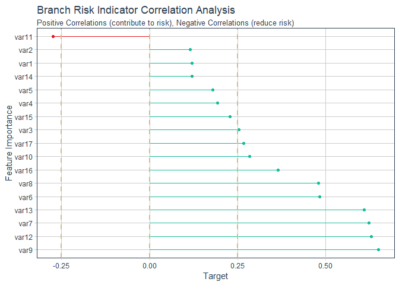

Branch ML
================

The data used in this model is the exact same as what has been used in the actual model. I have just anonymised the preditor variables and target variable. The target variable is simply a 1 (where monthly score exceeds threshold) and 0 when the score doesn't exceed the threshold.

``` r
library(plyr)
library(caret)
library(lmtest)
library(pscl)
library(MKmisc)
library(survey)
library(InformationValue)
library(tidyverse)
library(corrplot)
library(MASS)
library(ROCR)
library(corrr)
library(tidyquant)
```

``` r
#read data into R, mutate target variable as factor
data_18122018v3_anon<-read_csv("C:/Users/Michael/Desktop/data_18122018v3_anon.csv")
data<-data_18122018v3_anon%>%dplyr::mutate(target_var=as.factor(target_var))
```

``` r
summary(data)
```

    ##       var1              var2              var3             var4        
    ##  Min.   :0.00000   Min.   :0.00000   Min.   :0.0000   Min.   : 0.0000  
    ##  1st Qu.:0.00000   1st Qu.:0.00000   1st Qu.:0.0000   1st Qu.: 0.0000  
    ##  Median :0.00000   Median :0.00000   Median :0.0000   Median : 0.0000  
    ##  Mean   :0.01918   Mean   :0.08331   Mean   :0.1085   Mean   : 0.4605  
    ##  3rd Qu.:0.00000   3rd Qu.:0.00000   3rd Qu.:0.0000   3rd Qu.: 0.0000  
    ##  Max.   :5.00000   Max.   :2.00000   Max.   :6.0000   Max.   :32.0000  
    ##       var5              var6              var7              var8        
    ##  Min.   : 0.0000   Min.   : 0.0000   Min.   :  0.000   Min.   :  0.000  
    ##  1st Qu.: 0.0000   1st Qu.: 0.0000   1st Qu.:  0.000   1st Qu.:  0.000  
    ##  Median : 0.0000   Median : 0.0000   Median :  0.000   Median :  0.000  
    ##  Mean   : 0.1487   Mean   : 0.8135   Mean   :  1.529   Mean   :  1.052  
    ##  3rd Qu.: 0.0000   3rd Qu.: 1.0000   3rd Qu.:  2.000   3rd Qu.:  2.000  
    ##  Max.   :20.0000   Max.   :40.0000   Max.   :106.000   Max.   :102.000  
    ##       var9            var10             var11            var12        
    ##  Min.   : 0.000   Min.   :  0.000   Min.   : 0.000   Min.   :    0.0  
    ##  1st Qu.: 0.000   1st Qu.:  0.000   1st Qu.: 0.000   1st Qu.:    0.0  
    ##  Median : 0.000   Median :  0.000   Median : 0.000   Median :  691.0  
    ##  Mean   : 2.456   Mean   :  9.255   Mean   : 3.544   Mean   :  889.2  
    ##  3rd Qu.: 4.000   3rd Qu.:  8.000   3rd Qu.: 6.000   3rd Qu.: 1395.0  
    ##  Max.   :48.000   Max.   :838.000   Max.   :59.000   Max.   :23452.0  
    ##      var13             var14             var15             var16       
    ##  Min.   :    0.0   Min.   :0.00000   Min.   :0.00000   Min.   :0.0000  
    ##  1st Qu.:    0.0   1st Qu.:0.00000   1st Qu.:0.00000   1st Qu.:0.0000  
    ##  Median :  377.0   Median :0.00000   Median :0.00000   Median :0.0000  
    ##  Mean   :  602.5   Mean   :0.02679   Mean   :0.07949   Mean   :0.4277  
    ##  3rd Qu.:  850.5   3rd Qu.:0.00000   3rd Qu.:0.00000   3rd Qu.:0.0000  
    ##  Max.   :23817.0   Max.   :3.00000   Max.   :8.00000   Max.   :7.0000  
    ##      var17       target_var
    ##  Min.   :0.000   0:30658   
    ##  1st Qu.:0.000   1: 7297   
    ##  Median :0.000             
    ##  Mean   :1.161             
    ##  3rd Qu.:2.000             
    ##  Max.   :7.000

There are no N/As in the data, so we're right to go. Lets check the correlations and importance of variables.

``` r
# prepare training scheme
control <- trainControl(method="repeatedcv", number=10, repeats=10)
# train the model
model_vi <- train(target_var~., data=data, method="pls", preProcess="scale", trControl=control)
# estimate variable importance
importance <- varImp(model_vi, scale=FALSE)
# summarize importance
print(importance)
```

    ## pls variable importance
    ## 
    ##        Overall
    ## var7  0.052707
    ## var9  0.050408
    ## var12 0.047989
    ## var13 0.045953
    ## var6  0.034846
    ## var8  0.034577
    ## var16 0.028433
    ## var11 0.026790
    ## var17 0.023895
    ## var10 0.022531
    ## var3  0.021547
    ## var15 0.018579
    ## var4  0.015520
    ## var5  0.014536
    ## var2  0.009952
    ## var1  0.009516
    ## var14 0.008838

``` r
# plot importance
plot(importance)
```


The model suggests that var7, var9, var12 and var13 are important variables to be considered when building the final model

``` r
corrr_analysis <- data %>% mutate(target_var=as.numeric(target_var))%>%
  correlate() %>%
  focus(target_var) %>%
  #rename(feature == rowname) %>%
  arrange(abs(target_var)) %>%
  mutate(feature = as_factor(rowname)) 
corrr_analysis
```

    ## # A tibble: 17 x 3
    ##    rowname target_var feature
    ##    <chr>        <dbl> <fct>  
    ##  1 var2         0.116 var2   
    ##  2 var1         0.120 var1   
    ##  3 var14        0.121 var14  
    ##  4 var5         0.179 var5   
    ##  5 var4         0.193 var4   
    ##  6 var15        0.229 var15  
    ##  7 var3         0.253 var3   
    ##  8 var17        0.267 var17  
    ##  9 var11       -0.274 var11  
    ## 10 var10        0.284 var10  
    ## 11 var16        0.365 var16  
    ## 12 var8         0.479 var8   
    ## 13 var6         0.483 var6   
    ## 14 var13        0.609 var13  
    ## 15 var7         0.623 var7   
    ## 16 var12        0.629 var12  
    ## 17 var9         0.649 var9

``` r
corrr_analysis %>%
  ggplot(aes(x = target_var, y = fct_reorder(feature, desc(target_var)))) +
  geom_point() +
  # Positive Correlations - Contribute to risk
  geom_segment(aes(xend = 0, yend = feature), 
               color = palette_light()[[3]], 
               data = corrr_analysis %>% filter(target_var >0)) +
  geom_point(color = palette_light()[[3]], 
             data = corrr_analysis %>% filter(target_var >0 )) +
  
  # Negative Correlations - Prevent risk
    geom_segment(aes(xend = 0, yend = feature), 
                 color = palette_light()[[2]], 
                 data = corrr_analysis %>% filter(target_var<0 )) +
    geom_point(color = palette_light()[[2]], 
               data = corrr_analysis %>% filter(target_var<0 )) +
# Vertical lines
  geom_vline(xintercept = 0, color = palette_light()[[4]], size = 1, linetype = 2) +
  geom_vline(xintercept = -0.25, color = palette_light()[[4]], size = 1, linetype = 2) +
  geom_vline(xintercept = 0.25, color = palette_light()[[4]], size = 1, linetype = 2) +
  # Aesthetics
  theme_tq() +
  labs(title = "Branch Risk Indicator Correlation Analysis",
       subtitle = paste("Positive Correlations (contribute to risk),",
                        "Negative Correlations (reduce risk)"),
       y = "Feature Importance",
       x= "Target")
```



Checking for linear combiantions and highlight variables with near zero variance

``` r
#find linear combinations
findLinearCombos(data)
```

    ## $linearCombos
    ## list()
    ## 
    ## $remove
    ## NULL

``` r
#find near zero variance

nearZeroVar(data,names=TRUE,saveMetrics = TRUE)
```

    ##             freqRatio percentUnique zeroVar   nzv
    ## var1        65.343257   0.013173495   FALSE  TRUE
    ## var2        24.379617   0.007904097   FALSE  TRUE
    ## var3        23.770514   0.018442893   FALSE  TRUE
    ## var4        11.378092   0.081675669   FALSE FALSE
    ## var5        21.016158   0.055328679   FALSE  TRUE
    ## var6         4.088754   0.055328679   FALSE FALSE
    ## var7         5.186589   0.076406271   FALSE FALSE
    ## var8         3.818104   0.068502174   FALSE FALSE
    ## var9         5.534408   0.097483862   FALSE FALSE
    ## var10       22.260040   0.632327757   FALSE  TRUE
    ## var11       21.686418   0.144908444   FALSE  TRUE
    ## var12      123.703125   9.134501383   FALSE  TRUE
    ## var13      123.263566   7.659069951   FALSE  TRUE
    ## var14       41.203786   0.010538796   FALSE  TRUE
    ## var15       19.216523   0.023712291   FALSE  TRUE
    ## var16        7.915767   0.021077592   FALSE FALSE
    ## var17        3.740496   0.021077592   FALSE FALSE
    ## target_var   4.201453   0.005269398   FALSE FALSE

Now I'll use the Caret package to train/fit GLM model predictor as factor

First I'll set the control parameters, then split the data into a training and test set. Because I am also looking at performing 10-fold cross validation on the data, I won't set aside a validation set.

``` r
control <- trainControl(method="repeatedcv", number=10, repeats=10)

Train <- createDataPartition(data$target_var, p=0.7, list=FALSE)
training <- data[ Train, ]
testing <- data [ -Train, ]
```

``` r
##this finds the best combination of variables for logit##
mod_fit<-train(target_var~.,
               data=training, method="glmStepAIC", family="binomial",trControl = control)

mod_fit$results
mod_fit$finalModel
summary(mod_fit$finalModel)
```

While the model fit suggests an equation with quite a high accuracy, in practice the list of actual variables makes it very difficult for the goals of this project to be met i.e. develop an algorithm that can be used on a daily basis using variables I can extract easily, without relying on another department to deliver the data. Based on the above criteria, I chose to two specific variables that I knew could be obtained and loaded into the Qliksense app daily. Each month I run the whole algorithm again with all the variables to ensure that my manual selection is still valid.

``` r
#select variables manually

mod_fit_one<-train(target_var~var8+var9,
                   data=training, method="glm", family="binomial",trControl = control)
```

The results of the equation are below

``` r
summary(mod_fit_one)
```

    ## 
    ## Call:
    ## NULL
    ## 
    ## Deviance Residuals: 
    ##     Min       1Q   Median       3Q      Max  
    ## -2.7846  -0.3314  -0.2021  -0.2021   2.7933  
    ## 
    ## Coefficients:
    ##              Estimate Std. Error z value Pr(>|z|)    
    ## (Intercept) -3.880945   0.043913  -88.38   <2e-16 ***
    ## var8         0.503394   0.013014   38.68   <2e-16 ***
    ## var9         0.480739   0.007785   61.75   <2e-16 ***
    ## ---
    ## Signif. codes:  0 '***' 0.001 '**' 0.01 '*' 0.05 '.' 0.1 ' ' 1
    ## 
    ## (Dispersion parameter for binomial family taken to be 1)
    ## 
    ##     Null deviance: 26010  on 26568  degrees of freedom
    ## Residual deviance: 13313  on 26566  degrees of freedom
    ## AIC: 13319
    ## 
    ## Number of Fisher Scoring iterations: 6

``` r
pred <- predict.train(mod_fit_one, newdata=testing)

results<-table(pred, testing$target_var)

results
```

    ##     
    ## pred    0    1
    ##    0 8788  794
    ##    1  409 1395

``` r
sum(diag(results))/sum(results)
```

    ## [1] 0.8943439

The model is reasonably accurate, with a higher proportion of false positives than false negatives. For the purposes of this model, that is acceptable.

Conclusion
==========

While this model is not the best performing (Naive Bayes and Neural Net models performed better) and is not even the suggested equation from Caret, it achieves exactly what I was trying to achieve.
